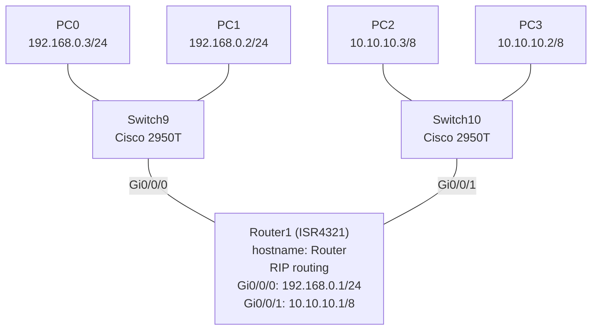

# Lab 01 - Inter-VLAN Routing with RIP

## Networking Concept

This lab demonstrates routing between two separate network segments using **RIP (Routing Information Protocol)**. Two switches, each on a different subnet, connect to a router that routes traffic between them using RIP.

## Topology



## Device Configuration

### Router1 (ISR4321)

| Interface | IP Address       | Network           |
|-----------|------------------|-------------------|
| Gi0/0/0   | 192.168.0.1/24   | 192.168.0.0/24    |
| Gi0/0/1   | 10.10.10.1/8     | 10.10.10.0/8      |

### End Devices

| Device | IP Address       | Subnet Mask      | Gateway      |
|--------|------------------|------------------|--------------|
| PC0    | 192.168.0.3      | 255.255.255.0    | 192.168.0.1  |
| PC1    | 192.168.0.2      | 255.255.255.0    | 192.168.0.1  |
| PC2    | 10.10.10.3       | 255.0.0.0        | 10.10.10.1   |
| PC3    | 10.10.10.2       | 255.0.0.0        | 10.10.10.1   |

### Switches

- Switch9 (Cisco 2950T-24) - default config, all ports in VLAN 1
- Switch10 (Cisco 2950T-24) - default config, all ports in VLAN 1

## Key CLI Commands

### Router1 configuration

```
no service password-encryption
hostname Router

interface GigabitEthernet0/0/0
 ip address 192.168.0.1 255.255.255.0
 no shutdown

interface GigabitEthernet0/0/1
 ip address 10.10.10.1 255.0.0.0
 no shutdown

router rip
```

## What This Lab Demonstrates

- **Inter-network routing** - routing between two different subnets (192.168.0.0/24 and 10.10.10.0/8) via a single router
- **RIP (Routing Information Protocol)** - distance-vector dynamic routing protocol advertising both networks
- **IP addressing** - Class C (192.168.0.0/24) and Class A (10.10.10.0/8) on the same router
- **Switch fundamentals** - Layer 2 switches connecting end devices to the router

## Files

| File                        | Description                          |
|-----------------------------|--------------------------------------|
| `inter-vlan-rip-routing.pkt` | Cisco Packet Tracer lab file (v8.2) |

> Open with Cisco Packet Tracer to view the full topology and device configurations.
