# Lab 02 - Basic VPN using GRE over IPsec with OSPF

## Networking Concept

This lab simulates a **site-to-site VPN** connecting two offices across a simulated internet using **GRE over IPsec**, with **OSPF** providing dynamic routing across the intermediate network.

### Why GRE + IPsec Together?

- **IPsec** encrypts IP packets but **only accepts unicast traffic** - it cannot carry multicast or broadcast.
- **GRE** encapsulates any protocol (unicast, multicast, broadcast) into a unicast packet, but provides **no encryption**.
- By wrapping traffic in GRE first, then encrypting with IPsec, we get both **tunneling flexibility** and **security**.

This combination is necessary because routing protocols like OSPF rely on **multicast** (224.0.0.5), which IPsec alone cannot transport.

## Topology

The lab uses 6 routers: 2 site routers (Router1 and Router6) connected through 4 intermediate "internet" routers (Router2-5).

```mermaid
graph LR
    PC0["PC0<br/>192.168.10.10/24"]
    PC1["PC1<br/>192.168.20.20/24"]

    R1["Router1 (2911)<br/>Site A<br/>Gi0/0: 192.168.10.1/24<br/>Gi0/1: 200.1.1.1/24<br/>Tun0: 172.16.0.1/30"]
    R2["Router2 (2911)<br/>200.1.1.2 / 200.2.2.1"]
    R3["Router3 (2911)<br/>200.2.2.2 / 200.3.3.1"]
    R4["Router4 (2911)<br/>200.3.3.2 / 200.4.4.1"]
    R5["Router5 (2911)<br/>200.4.4.2 / 200.5.5.1"]
    R6["Router6 (2911)<br/>Site B<br/>Gi0/0: 192.168.20.1/24<br/>Gi0/1: 200.5.5.2/24<br/>Tun0: 172.16.0.2/30"]

    PC0 --- R1
    R1 ---|200.1.1.0/24| R2
    R2 ---|200.2.2.0/24| R3
    R3 ---|200.3.3.0/24| R4
    R4 ---|200.4.4.0/24| R5
    R5 ---|200.5.5.0/24| R6
    R6 --- PC1

    R1 -.->|GRE/IPsec Tunnel<br/>172.16.0.0/30| R6
```



## Device Configuration

### Router1 (Cisco 2911) - Site A

| Interface | IP Address       | Purpose              |
|-----------|------------------|----------------------|
| Gi0/0     | 192.168.10.1/24  | LAN (Site A)         |
| Gi0/1     | 200.1.1.1/24     | WAN (to internet)    |
| Tunnel0   | 172.16.0.1/30    | GRE tunnel endpoint  |

### Router6 (Cisco 2911) - Site B

| Interface | IP Address       | Purpose              |
|-----------|------------------|----------------------|
| Gi0/0     | 192.168.20.1/24  | LAN (Site B)         |
| Gi0/1     | 200.5.5.2/24     | WAN (to internet)    |
| Tunnel0   | 172.16.0.2/30    | GRE tunnel endpoint  |

### Intermediate Routers (Internet Simulation)

| Router | Interface 1         | Interface 2         |
|--------|---------------------|---------------------|
| R2     | 200.1.1.2/24        | 200.2.2.1/24        |
| R3     | 200.2.2.2/24        | 200.3.3.1/24        |
| R4     | 200.3.3.2/24        | 200.4.4.1/24        |
| R5     | 200.4.4.2/24        | 200.5.5.1/24        |

### End Devices

| Device | IP Address       | Gateway       |
|--------|------------------|---------------|
| PC0    | 192.168.10.10/24 | 192.168.10.1  |
| PC1    | 192.168.20.20/24 | 192.168.20.1  |

## Key CLI Commands

### IKE Phase 1 - ISAKMP Policy (Router1)

```
crypto isakmp policy 10
 encr aes
 authentication pre-share
 group 2
!
crypto isakmp key IPSECGRE address 200.5.5.2
```

### IPsec Phase 2 - Transform Set & Crypto Map (Router1)

```
crypto ipsec transform-set VPN esp-aes esp-sha-hmac
!
crypto map MY_MAP 10 ipsec-isakmp
 set peer 200.5.5.2
 set transform-set VPN
 match address GRE_ACCESSLIST
!
ip access-list extended GRE_ACCESSLIST
 permit gre host 200.1.1.1 host 200.5.5.2
```

### GRE Tunnel (Router1)

```
interface Tunnel0
 ip address 172.16.0.1 255.255.255.252
 mtu 1476
 tunnel source GigabitEthernet0/1
 tunnel destination 200.5.5.2
 crypto map MY_MAP
```

### Apply Crypto Map to WAN Interface (Router1)

```
interface GigabitEthernet0/1
 ip address 200.1.1.1 255.255.255.0
 crypto map MY_MAP
 no shutdown
```

### OSPF on Intermediate Routers

```
router ospf 1
 log-adjacency-changes
 network 200.0.0.0 0.255.255.255 area 0
```

### Static Routes Through the Tunnel

```
! On Router1 - route to Site B LAN via tunnel
ip route 192.168.20.0 255.255.255.0 172.16.0.2

! On Router6 - route to Site A LAN via tunnel
ip route 192.168.10.0 255.255.255.0 172.16.0.1
```

### Mirror Configuration on Router6

```
crypto isakmp key IPSECGRE address 200.1.1.1
!
interface Tunnel0
 ip address 172.16.0.2 255.255.255.252
 tunnel source GigabitEthernet0/1
 tunnel destination 200.1.1.1
 crypto map MY_MAP
```

## What This Lab Demonstrates

- **VPN** - secure site-to-site connectivity over a public network
- **GRE tunneling** - encapsulating multicast/broadcast traffic into unicast
- **IPsec encryption** - IKE Phase 1 & 2, transform sets (ESP-AES + SHA-HMAC), crypto maps
- **OSPF** - dynamic routing across the intermediate "internet" routers (200.x.x.x networks)
- **Static routing** - directing LAN traffic through the GRE tunnel endpoints

## Files

| File                      | Description                          |
|---------------------------|--------------------------------------|
| `vpn-gre-ipsec-ospf.pkt`  | Cisco Packet Tracer lab file (v8.2) |

> Open with Cisco Packet Tracer to view the full topology and device configurations.
