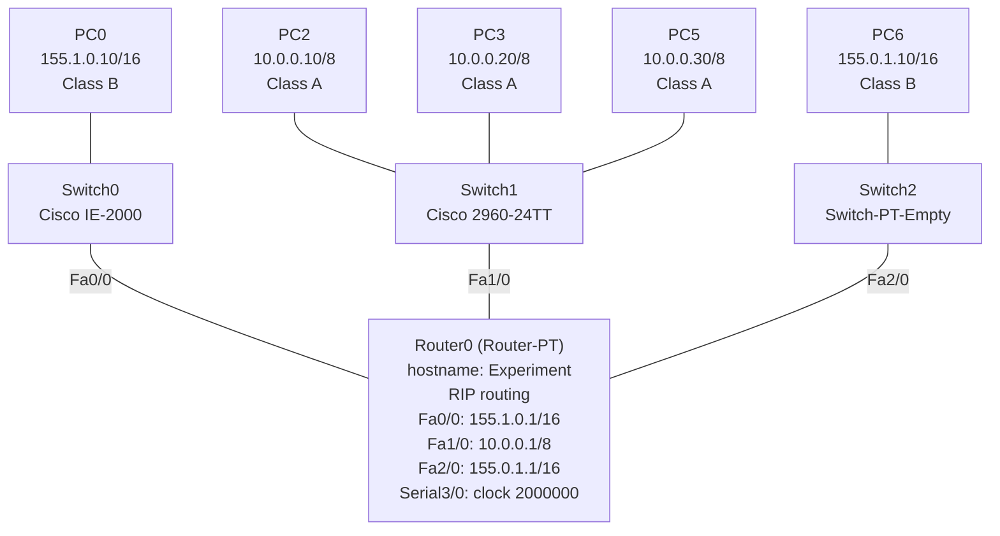

# Lab 03 - Connecting Different Subnet Classes (A and B)

## Networking Concept

This lab demonstrates how to connect networks that use **different IP address classes** (Class A and Class B) and route traffic between them using **RIP**. A single router connects three networks spanning two different address classes.

## Topology



## Device Configuration

### Router0 (Router-PT)

| Interface | IP Address       | IP Class | Network           |
|-----------|------------------|----------|-------------------|
| Fa0/0     | 155.1.0.1/16     | B        | 155.1.0.0/16      |
| Fa1/0     | 10.0.0.1/8       | A        | 10.0.0.0/8        |
| Fa2/0     | 155.0.1.1/16     | B        | 155.0.1.0/16      |
| Serial3/0 | -                | -        | clock rate 2000000|

### End Devices

| Device | IP Address       | Subnet Mask      | Gateway      | Class |
|--------|------------------|------------------|--------------|-------|
| PC0    | 155.1.0.10       | 255.255.0.0      | 155.1.0.1    | B     |
| PC2    | 10.0.0.10        | 255.0.0.0        | 10.0.0.1     | A     |
| PC3    | 10.0.0.20        | 255.0.0.0        | 10.0.0.1     | A     |
| PC5    | 10.0.0.30        | 255.0.0.0        | 10.0.0.1     | A     |
| PC6    | 155.0.1.10       | 255.255.0.0      | 155.0.1.1    | B     |

### Switches

- Switch0 (Cisco IE-2000 MultiLayer Switch)
- Switch1 (Cisco 2960-24TT)
- Switch2 (Cisco Switch-PT-Empty)

## Key CLI Commands

### Router0 configuration

```
service password-encryption
hostname Experiment

interface FastEthernet0/0
 ip address 155.1.0.1 255.255.0.0
 no shutdown

interface FastEthernet1/0
 ip address 10.0.0.1 255.0.0.0
 no shutdown

interface FastEthernet2/0
 ip address 155.0.1.1 255.255.0.0
 no shutdown

interface Serial3/0
 clock rate 2000000
 no shutdown

router rip

banner login "hello"
banner motd "This is a secure device"
```

## IP Address Classes Used

| Class | Range                   | Default Mask      | Used in this lab           |
|-------|-------------------------|-------------------|----------------------------|
| A     | 1.0.0.0 - 126.255.255.255 | 255.0.0.0 (/8)  | 10.0.0.0/8 (3 PCs)        |
| B     | 128.0.0.0 - 191.255.255.255 | 255.255.0.0 (/16) | 155.1.0.0/16, 155.0.1.0/16 |

## What This Lab Demonstrates

- **IP address classes** - Class A (10.0.0.0/8) and Class B (155.x.x.x/16) on the same router
- **Inter-class routing** - connecting networks with different class structures via a single router
- **RIP** - distance-vector routing protocol advertising all three networks
- **Serial WAN links** - clock rate configuration on serial interfaces
- **Multiple switches** - connecting end devices across different network segments

## Files

| File                              | Description                          |
|-----------------------------------|--------------------------------------|
| `connecting-subnet-classes.pkt`   | Cisco Packet Tracer lab file (v8.2) |

> Open with Cisco Packet Tracer to view the full topology and device configurations.
