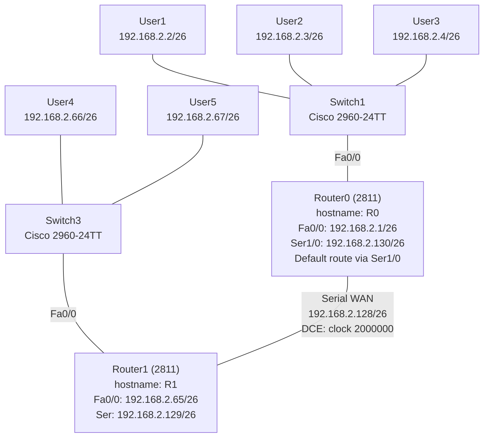

# Lab 04 - Subnetting, Console Access, Password Security, Static Routing & DCE/DTE

## Networking Concept

This lab combines several foundational networking skills:
- **Subnetting** - dividing 192.168.2.0 into /26 subnets
- **Console access** - connecting to routers via the console port
- **Password security** - securing privileged EXEC and line access with `enable password`
- **Static routing** - manually configuring a default route
- **DCE/DTE configuration** - setting clock rates on serial WAN links

## Topology



## Subnetting Breakdown

192.168.2.0/26 (255.255.255.192) creates 4 subnets, each with 62 usable hosts:

| Subnet | Network           | Range                  | Used For            |
|--------|-------------------|------------------------|---------------------|
| 1      | 192.168.2.0/26    | .1 - .62               | R0 LAN (User1-3)    |
| 2      | 192.168.2.64/26   | .65 - .126             | R1 LAN (User4-5)    |
| 3      | 192.168.2.128/26  | .129 - .190            | WAN link (R0-R1)    |
| 4      | 192.168.2.192/26  | .193 - .254            | Unused              |

## Device Configuration

### Router0 (Cisco 2811) - hostname: R0

| Interface | IP Address          | Purpose              |
|-----------|---------------------|----------------------|
| Fa0/0     | 192.168.2.1/26      | LAN (Subnet 1)       |
| Serial1/0 | 192.168.2.130/26    | WAN to R1 (Subnet 3) |
| Serial1/1 | -                   | clock rate 2000000   |

### Router1 (Cisco 2811) - hostname: R1

| Interface | IP Address          | Purpose              |
|-----------|---------------------|----------------------|
| Fa0/0     | 192.168.2.65/26     | LAN (Subnet 2)       |
| Serial    | 192.168.2.129/26    | WAN to R0 (Subnet 3) |

### End Devices

| Device | IP Address       | Subnet Mask         | Gateway       |
|--------|------------------|---------------------|---------------|
| User1  | 192.168.2.2      | 255.255.255.192     | 192.168.2.1   |
| User2  | 192.168.2.3      | 255.255.255.192     | 192.168.2.1   |
| User3  | 192.168.2.4      | 255.255.255.192     | 192.168.2.1   |
| User4  | 192.168.2.66     | 255.255.255.192     | 192.168.2.65  |
| User5  | 192.168.2.67     | 255.255.255.192     | 192.168.2.65  |

## Key CLI Commands

### Router0 (R0) - Password Security

```
hostname R0
enable password 4324
password 8484
```

### Router0 (R0) - Interface Configuration

```
interface FastEthernet0/0
 ip address 192.168.2.1 255.255.255.192
 no shutdown

interface Serial1/0
 ip address 192.168.2.130 255.255.255.192
 no shutdown

interface Serial1/1
 clock rate 2000000
 no shutdown
```

### Router0 (R0) - Default Static Route

```
ip route 0.0.0.0 0.0.0.0 Serial1/0
```

### Router1 (R1) - Interface Configuration

```
hostname R1

interface FastEthernet0/0
 ip address 192.168.2.65 255.255.255.192
 no shutdown

interface Serial1/0
 ip address 192.168.2.129 255.255.255.192
 no shutdown
```

## DCE vs. DTE

| Role | What It Does                                      | Configuration                |
|------|---------------------------------------------------|------------------------------|
| DCE  | Data Circuit-terminating Equipment - provides clock | `clock rate 2000000`       |
| DTE  | Data Terminal Equipment - receives clock           | No clock rate needed         |

Router0's Serial1/1 is the DCE end (provides the clock signal). The serial cable in Packet Tracer determines which end is DCE and which is DTE. The DCE end **must** have a `clock rate` set, or the link will stay down.

## What This Lab Demonstrates

- **Subnetting** - dividing 192.168.2.0 into /26 subnets (255.255.255.192)
- **Console access** - initial device configuration via console port
- **Password security** - `enable password`, line passwords
- **Static routing** - default route (`0.0.0.0/0`) pointing to Serial1/0
- **DCE/DTE** - serial WAN connections with clock rate synchronization

## Files

| File                                        | Description                          |
|---------------------------------------------|--------------------------------------|
| `subnetting-console-static-routing.pkt`     | Cisco Packet Tracer lab file (v8.2) |

> Open with Cisco Packet Tracer to view the full topology and device configurations.
